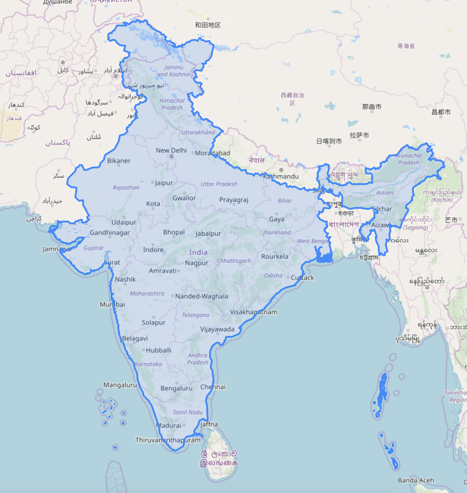
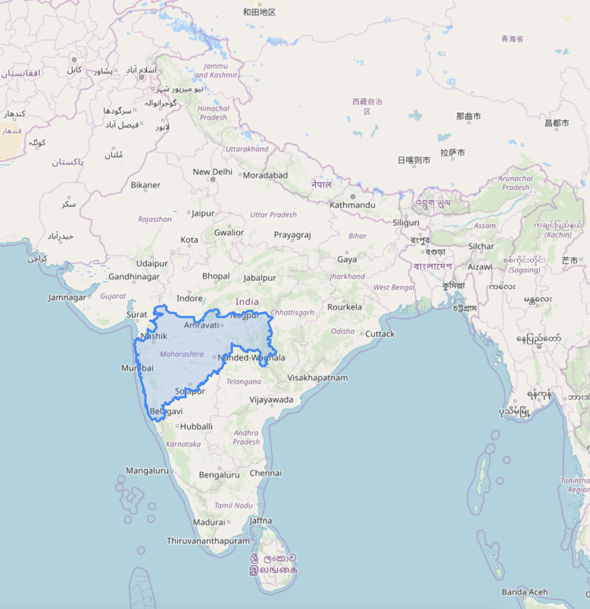
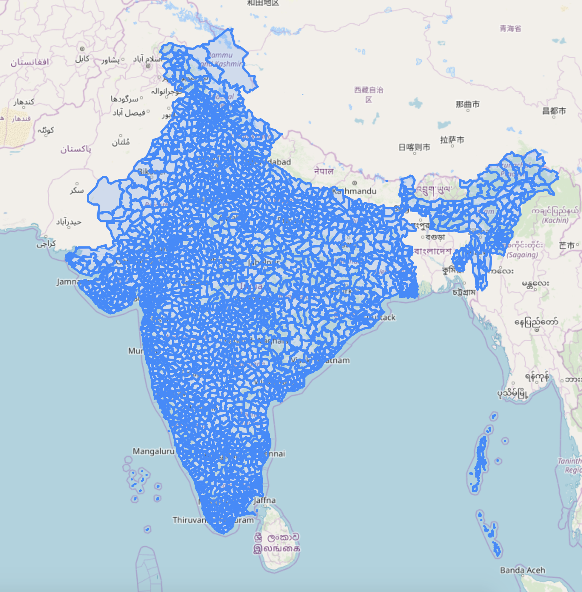

# Visualize Indian Maps in Folium
A Project to Visualize Indian Map.

## Installation
Installing Fiona from below 
- https://www.lfd.uci.edu/~gohlke/pythonlibs/
- https://gis.stackexchange.com/questions/121157/how-to-fix-python-importerror-dll-load-failed-the-specified-module-could-not-b

## Source of GeoPackage and Shape file's
- GADM https://gadm.org/download_country_v3.html
- GeoNames http://download.geonames.org/export/dump/
- Survey of India - https://indiamaps.gov.in/soiapp/

## Usage
<placeholder>

## Output

### Indian Boundary 

### State Boundary (example: Maharashtra)

### All District Boundary

